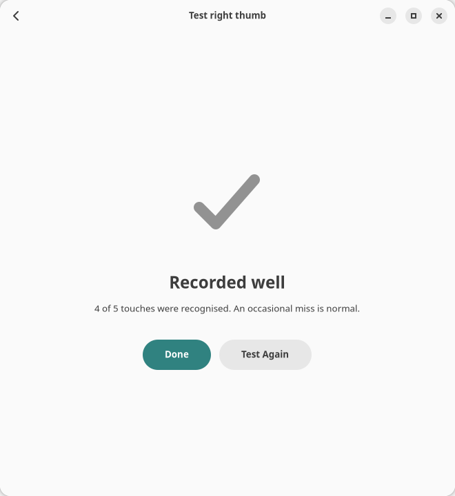

# Fingerprint Manager

A small GTK app for Linux that guides you through enrolling fingerprints and then
checks how well each one was recorded. It talks to [fprintd](https://fprint.freedesktop.org/),
so it works with any reader that fprintd supports.

**Linux only.** It does not run on Windows or macOS: those systems have no fprintd, and
they keep fingerprint enrollment inside Windows Hello and Touch ID, where apps can't reach it.

| Home | Enrolling |
| --- | --- |
|  |  |

## What it does

- **Shows every finger at a glance.** Both hands are drawn with a status dot on each
  fingertip: recognised well, not tested yet, borderline, poor, or not enrolled.
- **Tells you what to do next.** A card at the top names the most useful next step,
  such as testing a finger that was never tested or re-enrolling one that scored badly.
- **Explains each touch while enrolling.** A progress ring fills as touches are accepted.
  Rejected touches say why (off-centre, not read clearly, finger not lifted), and the
  tips move from the centre of the finger to its tip and edges.
- **Tests the result.** A five-touch test gives a verdict: 4–5 recognised is "Recorded
  well", 3 is "Borderline", fewer is "Poorly recorded" with a re-enroll button.
- **Makes the lock screen work like a MacBook's (GNOME).** Optional switches keep the
  sensor listening whenever the lock screen is lit and let the power button lock, wake
  and unlock the computer. See [Lock screen switches](#lock-screen-switches).

Match-on-chip readers never expose the fingerprint image, so quality is judged from the
reader's verdict on each touch and from the test score. The app stores only the last test
score and its date per finger, in `~/.local/share/fingerprint-manager/results.json`.

## Requirements

- fprintd with a supported fingerprint reader
- Python 3 with PyGObject
- GTK 4.14 or newer and libadwaita 1.6 or newer

On Ubuntu or Debian:

```sh
sudo apt install fprintd python3-gi gir1.2-gtk-4.0 gir1.2-adw-1
```

On Fedora:

```sh
sudo dnf install fprintd python3-gobject gtk4 libadwaita
```

## Running

```sh
git clone https://github.com/melhzy/fingerprint-manager.git
cd fingerprint-manager
./fingerprint_manager.py
```

To add it to your app grid, run `./install.sh`. It writes a launcher to
`~/.local/share/applications` that points at this folder.

To try the interface without a reader, run `./fingerprint_manager.py --demo`. This uses a
simulated sensor and saves nothing.

## Lock screen switches

On GNOME, the lock screen has two pages, a clock page and a password page, and the
fingerprint sensor only listens while the password page is showing. On a MacBook the
sensor listens whenever the lock screen is lit, and the power button (which holds the
sensor) wakes and unlocks in one press. Two switches under *Lock screen* on the home page
bring Ubuntu close to that, using GNOME's own password page and settings.

**Sensor ready whenever the lock screen is on** installs a small GNOME Shell extension
from this repo's `shell-extension` folder into `~/.local/share/gnome-shell/extensions` and
enables it. While the screen is locked, the extension:

- opens the password page as soon as the screen locks, lights up or wakes from sleep, so
  a finger resting on the sensor unlocks the computer;
- lets the power button open the password page like any other key, and stops it from
  suspending or shutting down a locked computer.

The password field keeps working as before, with GNOME's own retry limits. Escape still
returns to the clock page. Turning the switch off disables and removes the extension.

**Power button locks the screen** sets GNOME's *Power Button Behavior* to Nothing and
lets the extension handle the press: while you work, a press locks the screen, like the
Touch ID button on a Mac. Music keeps playing, because the computer does not go to sleep.
The next press, with your finger on the sensor, unlocks. Off restores the default action
(a Power Off dialog on Ubuntu); Power Off stays available in the top-right menu either
way. This switch only becomes available once the sensor switch is working.

Good to know:

- The first time you turn the sensor switch on, and again after every update of the app,
  log out and back in. GNOME Shell only looks for new extensions, and reads their code,
  when it starts; locking or suspending is not enough. The switch says so while an
  update is waiting.
- A touch cannot wake a dark or sleeping computer. From a dark screen, any key does.
  From sleep, open the lid, press the power button, or press the touchpad firmly for a
  second (a light tap is ignored). Then keep your finger on the sensor. The keyboard
  cannot wake this laptop from sleep: the kernel turns that off on AMD machines because
  the firmware mishandles it.
- If the lid is closed less than half a minute after the computer woke up, it waits until
  that half minute is over before it goes back to sleep, so the screen may still be on when you open
  the lid again. Press the power button once if the screen does not light up.
- Fingerprints unlock the screen, not the login keyring that holds your saved Wi-Fi and
  web passwords. After a restart, the first app that needs the keyring asks for your
  password once, as a Mac does after a restart. Signing in with your password instead of
  a finger unlocks the keyring at the same time.
- On Ubuntu, enrolling a finger also adds the fingerprint module to the shared password
  stack (`common-auth`), which the lock screen's password service includes. The password
  service then grabs the reader before GNOME's own fingerprint service, and after one
  failed touch or its 15-second timeout it stops listening: the prompt says "Failed to
  match fingerprint", a resting finger does nothing, and only the password works until
  the dialog resets. The fix is to keep the fingerprint module out of the lock screen's
  password service only, so GNOME's fingerprint service keeps the reader and retries.
  As root: copy `/etc/pam.d/gdm-password` somewhere safe; create
  `/etc/pam.d/common-auth-nofprint` holding the lines of `/etc/pam.d/common-auth`
  without the `pam_fprintd.so` line, with each `success=N` jump lowered by one; then in
  `/etc/pam.d/gdm-password` replace `@include common-auth` with
  `@include common-auth-nofprint`. Fingerprints keep working for `sudo` and admin
  prompts, which still use `common-auth`.
- The extension declares support for GNOME Shell 50, the only version it was tried on. The
  switches are hidden on other desktops.

## Good to know

- Enrolling or deleting a fingerprint asks for your password (fprintd's polkit rule).
  Testing does not.
- Re-enrolling a finger deletes its old print first, because readers that check for
  duplicates would otherwise reject it. If you cancel partway, that finger stays
  unenrolled until you enroll it again. The app warns before doing this.

## Tested hardware

| | |
| --- | --- |
| Laptop | Dell Inspiron 14 7425 2-in-1 |
| Fingerprint sensor | Goodix MOC Fingerprint Sensor (match-on-chip, press type), USB ID `27c6:639c`, firmware 01010274 |
| Linux distribution | Ubuntu 26.04.1 LTS (Resolute Raccoon), x86_64 |
| Linux kernel | 7.0.0-34-generic |
| Desktop | GNOME Shell 50.1 on Wayland |
| Fingerprint stack | fprintd 1.94.5, libfprint 1.95.1 |

Other readers supported by fprintd should work but have not been tried.

## License

MIT. See [LICENSE](LICENSE).
